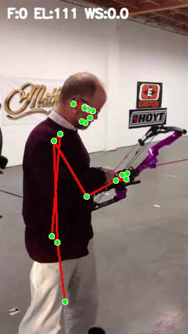
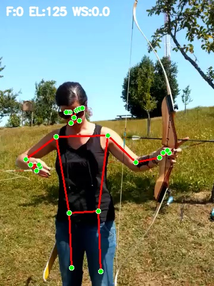

# Archery — Precision & Posture Evaluation 

**Author:** Tushar R. Islampure  
**Date:** August 2025

A prototype system for **archery posture evaluation** using computer vision and lightweight machine learning.  
It detects release moments, measures biomechanical metrics, and generates **annotated videos** + **PDF reports**.

---

##  Features
- Pose landmark extraction via MediaPipe Pose
- Elbow angle, stance width, wrist speed, and angular velocity computation
- Automatic **release detection** using spike correlation between wrist speed and elbow velocity
- Simple Random Forest classifier for posture quality (GOOD / BAD)
- Polished PDF feedback report with:
  - Methodology, claims & novelty
  - Charts & sample frames
- Streamlit demo app for easy playback & metric visualization
- Browser-compatible annotated videos (`H.264 / yuv420p`)

## Example Annotated Frames



 - like this their are lots of frame from all the 5 videos so you can check the images folder

---

##  Folder Structure (expected)
```
archery-posture-ai/
├── app_streamlit.py      # Streamlit demo app
├── main_pro.py           # Processing & report generation
├── input_videos/         # input .mp4 files here
├── outputs_videos/       # Generated annotated videos 
├── output_frames/        # Key extracted frames
├── metrics_all/          # Per-video CSV metrics
├── plots_3d/             # Charts for PDFs
├── reports/              # Generated PDF reports
└── requirements.txt
```

---

##  Quick setup & run (Windows / macOS / Linux)

1. Create & activate virtual environment
```bash
# Linux / macOS
python3 -m venv venv
source venv/bin/activate

# Windows (PowerShell)
python -m venv venv
venv\Scripts\Activate.ps1
```

2. Install dependencies
```bash
pip install -r requirements.txt
```

3. Install ffmpeg (required to guarantee browser-compatible H.264 videos)
- Ubuntu/Debian: `sudo apt update && sudo apt install ffmpeg -y`
- macOS (Homebrew): `brew install ffmpeg`
- Windows: download a **full GPL** build with libx264 enabled (e.g. from https://www.gyan.dev/ffmpeg/builds/) and add its `bin/` to your PATH.

Verify: `ffmpeg -version` and ensure it includes `--enable-libx264`.

4. Add your 5 `.mp4` videos into `input_videos/` (the videos provided by FutureSportler).

5. Run the processing script (produces annotated videos, CSVs, PDF reports):
```bash
python main_pro.py
```

6. Launch the Streamlit demo:
```bash
streamlit run app_streamlit.py
```

Open the Streamlit URL, select a video, and use the “Annotated” tab to view the annotated (H.264) output. If ffmpeg is installed the processing script will convert OpenCV temp output into browser-friendly H.264 automatically.

---

## License
See [LICENSE](LICENSE) for details.
